# En este apartado se vera como subnetiar dos redes a una misma para compartir informacion

Primero se debe ir a [Portal azure](https://portal.azure.com/#home) y deberemos buscar "Grupo de recursos y daremos en crear:
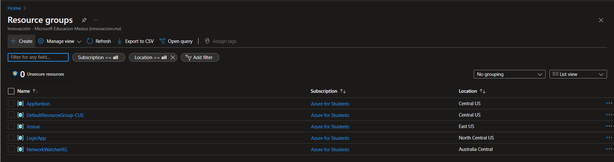
Nos abrira una ventana en donde debemos llenar todo lo que nos pide y damos en revisar y crear
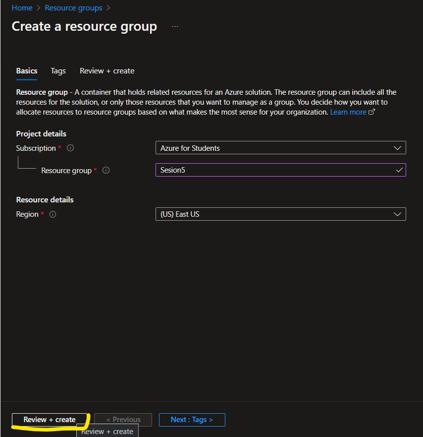
Ya creado nuestro grupo de recurso procederemos a crear nuestros recursos que seran las maquinas virtuales
Para ello deberemos ingresar nuevamente en la pagina de [Portal azure](https://portal.azure.com/#home) y buscaremos "Maquinas virtuales" y crearemos 2  
Y de igual manera crearemos 2 redes virtuales teniendo en cuenta que tanto las maquinas virtuales como las redes deben estar en la misma zona para que se puedan sincronizar

Al crear nuesrtras maquinas virtuales debemos ver que en el apartado de redes aparezca las redes virtuales que creamos previamente y un punto igual de importante es que debemos crear la maquina virtual con contraseña 
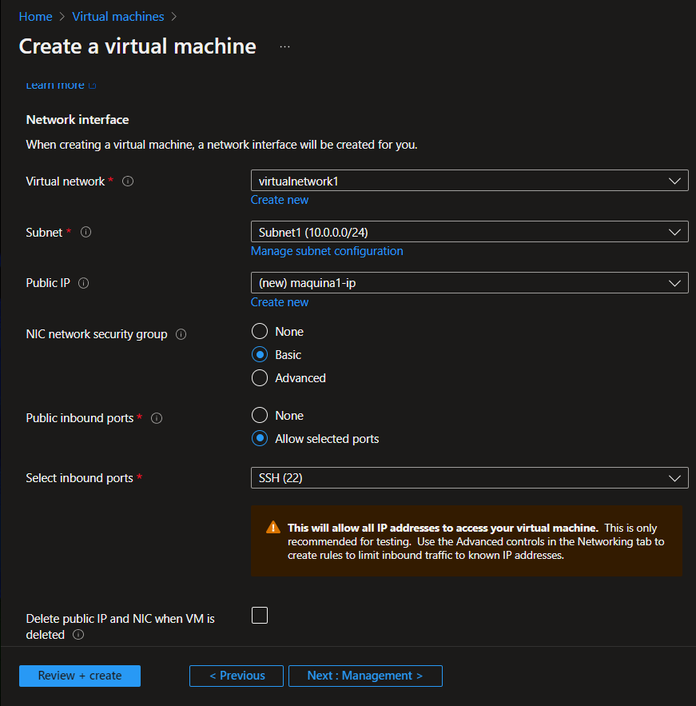

Una vez creadas tanto las maquinas virtuales como las redes virtuales abriremos la maquina virtual 1 y la conectaremos en SSH
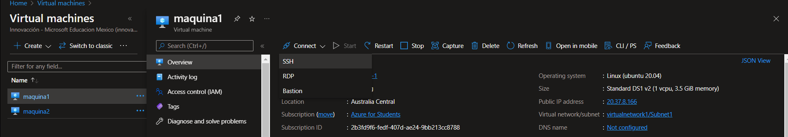
Despues copiaremos el comando para ejecutar la maquina
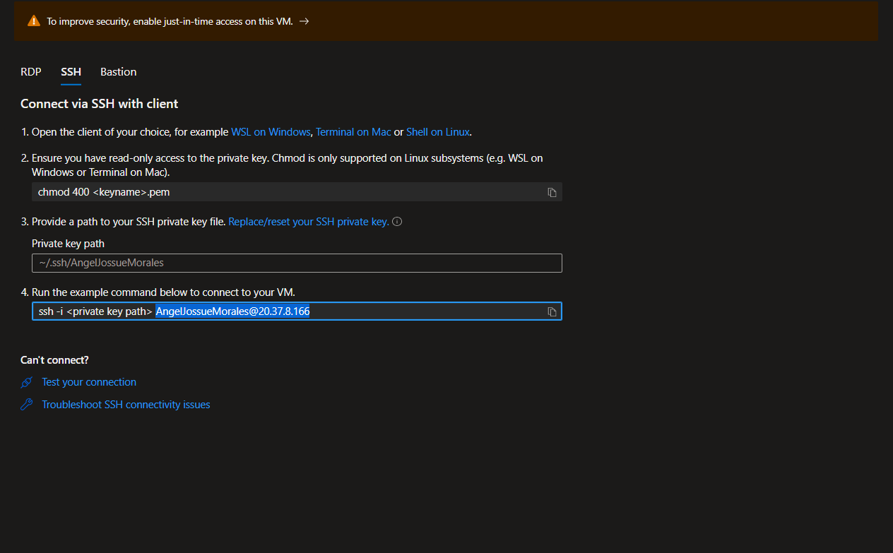
Y correremos la maquina dando click en Azure Cloud Shell
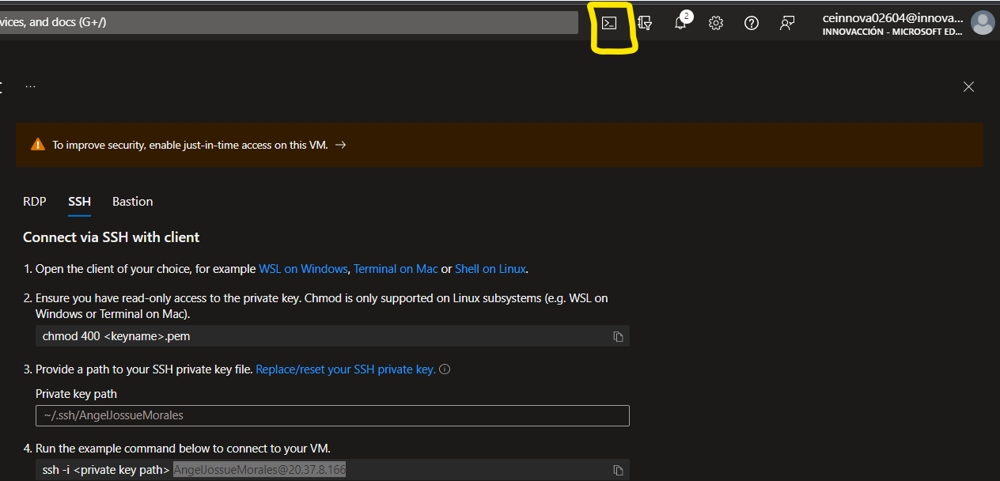
Lo cual nos abrira una ventana en la parte inferior de la pagina
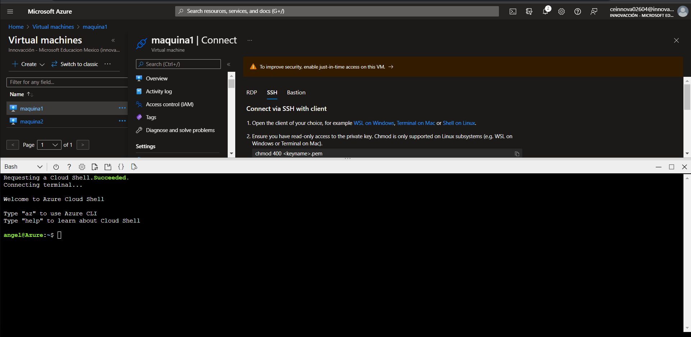
En donde ejecutaremos las siguientes lineas:
* ssh "lo que copiaste anteriormente"
Despues escribiremos:
* Yes
* Te pedira la contraseña (La que escribiste al crear la maquina virtual)
Si se ejecuto todo correctamente te aparecera esto:
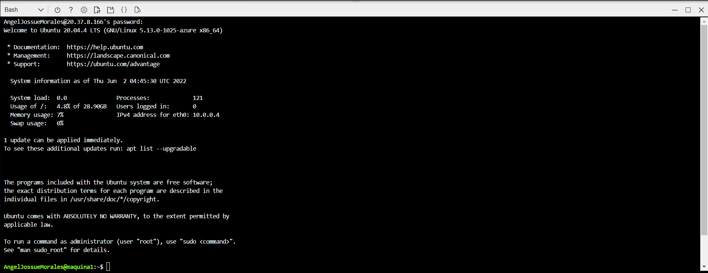
** Te daras cuenta que lo hiciste bien si la terminal al final de tu nombre de usurio despues del @ esta el nombre de la maquina virtual

##### Ya estas dentro de la maquina virtual
Para corroborar que si estas completamente dentro de la maquina virtual escribiras el codigo:
*sudo apt-get moo*
Y si estas correctamente conectado te aparecera lo siguiente:
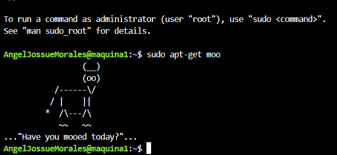
Ahora entraras en la red virtual 1 en el apartado de emparejamiento y le damos en agregar:
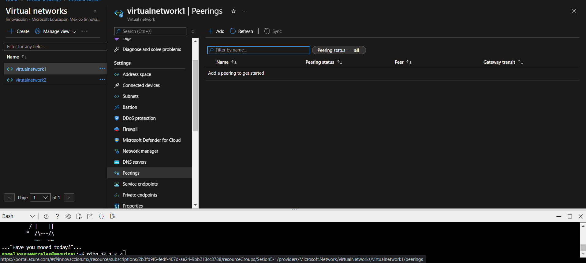
Agregaremos nombres en las casillas
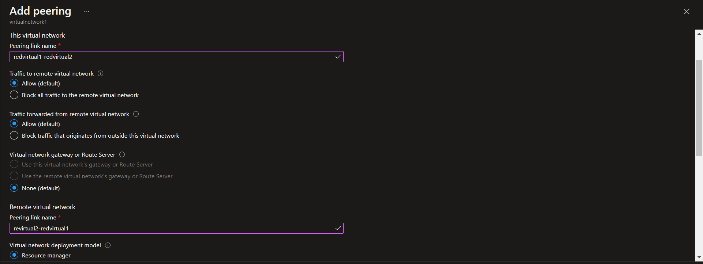
y escojeremos en el apartado de red virtual la segunda red virtual que creamos y agregamos
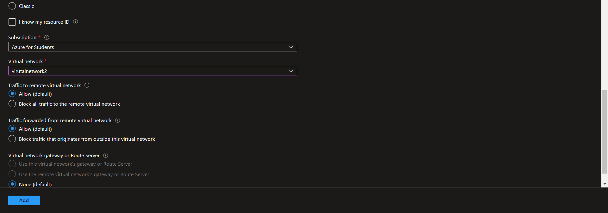
Una vez creado esperaremos a que el estado de emparejamiento se encuentre conectado:
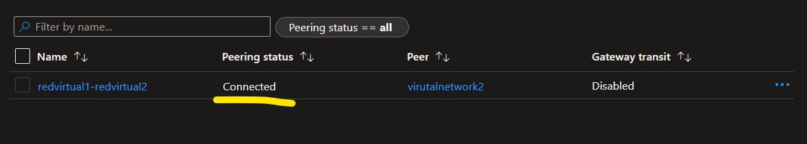
Una vez en este paso te dirigiras a la segunda red virtual que creaste y le daras en el apartado de dispositivos conectados y copiaremos la direccion IP de la maquina:
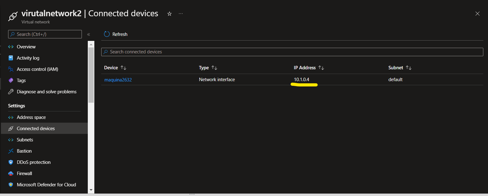
Una vez copiada la direccion IP nos iremos a la maquina virtual que teniamos abierta y escribiremos el codigo:
*pin "direccion IP que copiaste"*
Y te aparecera lo siguiente:
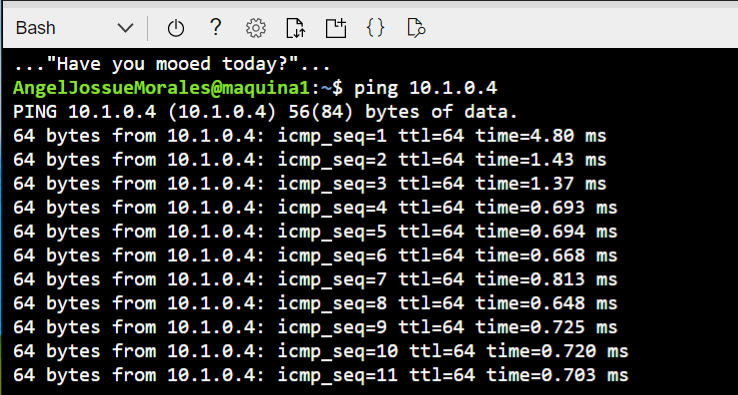
###Listo ya emparejamos dos redes virtuales en una sola :)
